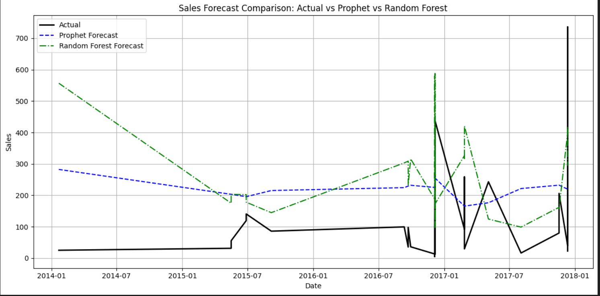
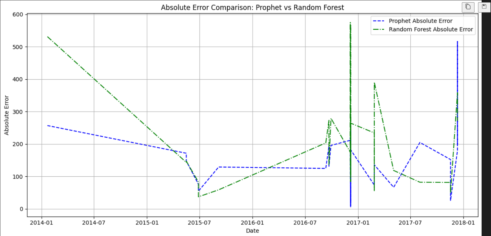

# Future_ML_01
## First Tast: ML Intership with Future Interns
Build an AI-powered dashboard that predicts future sales trends using historical retails sales data
A project focused on predicting future retail sales trends using historical sales data. This solution combines machine learning models and business intelligence tools to deliver actionable insights through an interactive dashboard.

## Project Overview
This project demonstrates the application of time series forecasting and regression analysis on retail sales data (daily, weekly, or monthly). It aims to help businesses make informed decisions by predicting future sales, identifying seasonality patterns, and visualizing trends using:

Python for data preprocessing and model training

Machine Learning models: Prophet and Random Forest Regressor

Power BI for dashboard development

The final deliverable includes both the trained models and a fully functional Power BI dashboard showing forecasts, trends, and key metrics.

## Features
Historical sales data exploration and cleaning

Forecasting using two models:

Prophet for time series trend and seasonality forecasting

Random Forest Regressor for regression-based prediction

Visualization of:

Predicted sales trends

Seasonality and holiday effects

Model performance metrics

Interactive Power BI Dashboard displaying forecast insights

## Tools & Technologies Used
Python (Prophet, Scikit-learn, Pandas, Matplotlib)

Power BI

Jupyter Notebook for model development and experimentation

## Skills Gained
Time Series Forecasting

Regression Analysis

Data Preprocessing and Feature Engineering

Building Interactive Dashboards with Power BI

Model Evaluation and Comparison

## Sample Visualizations

## How to Use
Clone this repository
Install dependencies like pandas, prophet etc

Run notebooks in the notebooks/ directory to explore models and generate forecasts.

Open the Power BI file (powerBI file) and load forecast outputs from the outputs.

Customize the dashboard with your own dataset if required.